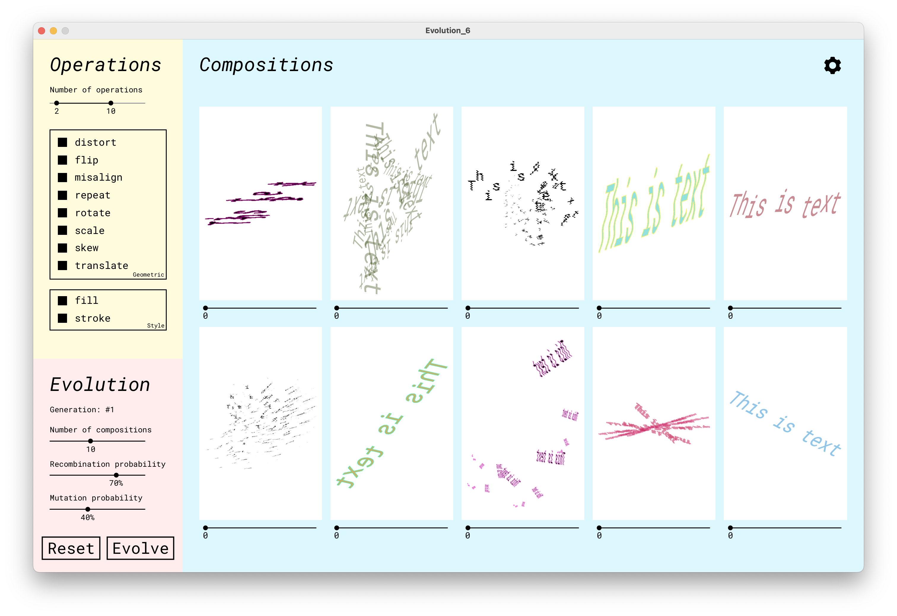

# Evolving Typographic Compositions

We developed an Interactive Evolutionary System to generate typographic compositions. The system evolves sequences of operations that are then applied to text to create the compositions. Besides the main program, we also created a complementary tool to edit the resulting compositions from the main system.



*Interface of the Evolutionary System*

## Installation

To run our program in your machine you must follow these steps:

1. Download and Install Processing through the official website: [processing.org](https://processing.org/)
2. Install Library dependencies
3. Clone the repository or download ZIP
4. Locate the program folder you want to open (Evolutionary or Editor)
5. Open the main `.pde` file of the program you want to use (Computational_Evolution_of_Typographic_Compositions.pde or Editor.pde)
6. Run the Sketch

## Using the system

The system can be used as is, but if you want to change some more advanced aspects continue reading this section.

### Change Font

To change the font used in the compositions you should follow these steps:

1. Download the `.ttf` file of the desired font from [Google Fonts](https://fonts.google.com/)
2. Add the file to the Sketch data folder
3. Add the file name to the fonts Array inside the code

```java
String[] fonts = {
"RobotoMono-Regular.ttf",
"IBMPlexSerif-Regular.ttf",
"RobotoMono-Thin.ttf",
"IBMPlexSerif-Thin.ttf",
"RobotoMono-Bold.ttf",
"IBMPlexSerif-Bold.ttf"
};
```

1. Open `config.json` file (which is inside the Sketch data folder) and change the `fontNo` variable to the corresponding position of the font you added to the Array

### Change Composition’s Resolution

To change the resolution of the compositions being evolved you can open `config.json` file (which is inside the Sketch data folder) and change the `proportions`. `w` for the composition’s width and `h` for the height. 

## Dependencies

The system uses the library [Geomerative](https://github.com/rikrd/geomerative) to retrieve the outlines of the text. To install this library through the Processing Library Manager:

1. Open Processing
2. Go to `Sketch` → `Import Library` → `Add Library`
3. Search for `Geomerative` and click `Install`
